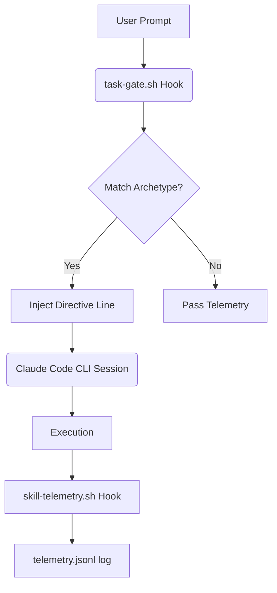
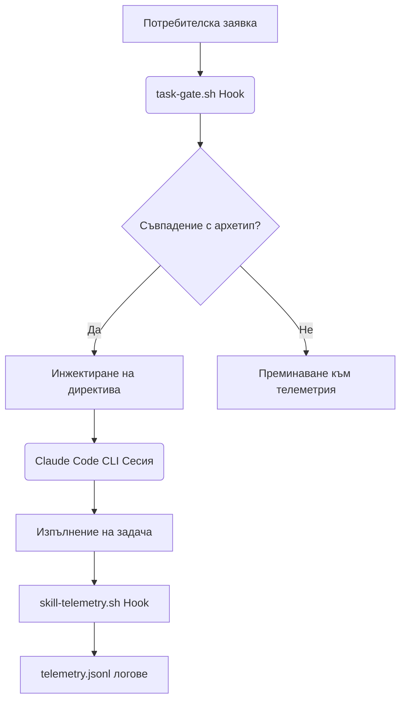

# auto-selector

An automation, routing, and parallel delegation layer for the Claude Code CLI, built and validated on Termux/Android. It deterministically gates user prompts into task archetypes to inject runtime guidance directives and runs parallel Kimi Code CLI agents in isolated git worktrees with schema validation and salvage capabilities.

## What It Is
`auto-selector` provides two main pillars to optimize task execution in Claude Code:
1. **Task-Gate Hook ([task-gate.sh](hooks/task-gate.sh)):** A deterministic parser running on `UserPromptSubmit` that matches prompts against 11 archetypes to inject a single process directive. It includes Cyrillic morphology matching, effort overlay, session deduplication, and a telemetry loop.
2. **Delegation Launcher ([kimi_parallel.sh](scripts/kimi_parallel.sh)):** A parallel wrapper for the Kimi Code CLI that manages task briefs using git-worktree isolation, timeout protection, and output validation.

## Why: Evidence-Driven Design
The system's architecture is shaped by empirical evidence from design history:
- **Directives over Menus:** Suggestion menus with ranked choices are ignored; single, clear directives are followed. The gate injects exactly one directive line at a time.
- **Cheap and Deterministic:** No per-prompt LLM calls or embedding index lookups are used. Pure bash+awk word-boundary matching takes ~120ms (measured at 122ms for a single `awk` spawn) with zero API cost.
- **Continuous Evaluation:** A telemetry loop ([skill-telemetry.sh](hooks/skill-telemetry.sh)) correlates gate directives with actual skill invokes (`cache/skill-telemetry.jsonl`). Rules not followed are pruned.

## Repository Layout
| Directory | Purpose | Key Contents |
| :--- | :--- | :--- |
| [docs/](docs) | Design specifications and snaps | specs, [settings.json.snapshot](docs/settings.json.snapshot) |
| [hooks/](hooks) | Claude Code CLI hook scripts | [task-gate.sh](hooks/task-gate.sh), [skill-telemetry.sh](hooks/skill-telemetry.sh), [state-reinject.sh](hooks/state-reinject.sh), [log-rotate.sh](hooks/log-rotate.sh) |
| [research/](research) | Pipeline studies and sweeps | [kimi-selector-analysis.md](research/kimi-selector-analysis.md), [web-routing-hooks-sweep.md](research/web-routing-hooks-sweep.md) |
| [scripts/](scripts) | Kimi launchers and helpers | [kimi_parallel.sh](scripts/kimi_parallel.sh), [validate_output.py](scripts/validate_output.py), [brief_lib.sh](scripts/brief_lib.sh) |
| [tests/](tests) | Regression test suites | [test-task-gate.sh](tests/test-task-gate.sh), [test-kimi-parallel.sh](tests/test-kimi-parallel.sh) |

## The Task-Gate
The task-gate classifies user prompts into one of 11 archetypes: `delegate`, `fix`, `review`, `test`, `commit`, `config`, `deploy`, `research`, `bundle`, `build`, or `memory`.

Bulgarian keywords are matched via left-anchored stems (e.g. ` грешк`, ` бъг`, ` делегира`, ` поправ`, ` създа`, ` проуч`, ` намери`, ` направ`, ` напиш`) to support Cyrillic morphology (definite articles and inflections). Explicit intensity phrases append an effort overlay (`HIGH`/`LOW`), and deduplication (`cache/task-gate-<sid>.state`) avoids repeat injections until the archetype changes.

### Example Directive (fix archetype)
Prompt: "Поправи грешката в кода"
Injected Directive:
```
TASK-GATE [fix]: invoke superpowers:systematic-debugging BEFORE proposing any fix; reproduce first, then root-cause. Own pre-existing defects too.
```

## The Parallel Launcher
The launcher fans out briefs to concurrent Kimi agents. Options include `--repo`, `--model`, `--timeout`, `--no-worktree`, `--json`, `--results-dir`, `--max-parallel`, `--base`, `--schema-mode`, and `--lint`.

### Brief Frontmatter
Briefs can override CLI options using a YAML frontmatter block:
```yaml
---
model: kimi-code/kimi-for-coding-highspeed
timeout: 20m
schema: schemas/output_schema.json
skills: git-diff, file-edit
---
## Goal
...
```

### Status Table Variants
The launcher classifies execution into one of the following statuses:
- `OK`: Task finished successfully, schema valid.
- `PARTIAL(schema)`: Schema validation failed, but a partial payload was salvaged into `<name>.partial.json` containing `_missing` and `_invalid` keys.
- `FAILED(schema)`: Output did not match the schema (under `--schema-mode strict`).
- `FAILED(timeout)`: Execution timed out (enforced by `timeout -k 10` on the host wrapper).
- `FAILED(quota)`: Quota/rate-limit hit (matched via guard strings in logs).
- `FAILED(exit)`: Process terminated with a non-zero exit status due to other errors.

## Installation & Wiring
1. **Set script permissions:**
   ```bash
   chmod +x hooks/*.sh scripts/*.sh scripts/*.py tests/*.sh
   ```
2. **Wiring in Claude Code `settings.json`:**
   Add these configurations:
   ```json
   {
     "hooks": {
       "UserPromptSubmit": [{"matcher": "*", "hooks": [{"type": "command", "command": "bash '/data/data/com.termux/files/home/.claude/hooks/task-gate.sh'", "timeout": 10}]}],
       "PostToolUse": [{"matcher": "Skill|Agent", "hooks": [{"type": "command", "command": "bash '/data/data/com.termux/files/home/.claude/hooks/skill-telemetry.sh'", "timeout": 10, "async": true}]}],
       "SessionStart": [{"matcher": "compact", "hooks": [{"type": "command", "command": "bash '/data/data/com.termux/files/home/.claude/hooks/state-reinject.sh'", "timeout": 10}]}],
       "SessionEnd": [{"matcher": "*", "hooks": [{"type": "command", "command": "bash '/data/data/com.termux/files/home/.claude/hooks/log-rotate.sh'", "timeout": 30, "async": true}]}]
     }
   }
   ```
3. **Off-Termux Porting:**
   - Change shebangs from `#!/data/data/com.termux/files/usr/bin/bash` to `#!/usr/bin/env bash`.
   - Update absolute paths in `settings.json` from `/data/data/com.termux/files/home/` to match your home directory.

## Testing
Run the regression tests (ensure `gawk` is available as `awk` and a UTF-8 locale is set):
- **Task-Gate (68 checks):**
  ```bash
  LC_ALL=C.UTF-8 bash tests/test-task-gate.sh hooks/task-gate.sh
  ```
- **Launcher (33 checks):**
  ```bash
  LC_ALL=C.UTF-8 bash tests/test-kimi-parallel.sh $(pwd)/scripts/kimi_parallel.sh
  ```

## Origin Note
Built on Termux/Android; all paths are Termux-specific sandboxed directories. The toolset is portable to standard Linux/macOS environments by modifying shebangs and configuration paths.

### Architecture Mapping


### Fault Handling Manual
| Component / Error | Root Cause | Mitigation |
| :--- | :--- | :--- |
| **Hook timeout** | A hook script hung or took longer than 10s (the default settings.json timeout). | Check if state files in `cache/` are locked, or run the hook manually to debug. All hooks are designed to run in <130ms. |
| **Kimi hang** | The `kimi` process hung during parallel execution. | Launcher uses `timeout -k 10` on the host to force-terminate hung processes. Check brief's specified timeout. |
| **Quota exhaustion** | Kimi rate limits or credits were exceeded. | The script flags `FAILED(quota)`. Fall back to `agy-delegate` or invoke native subagents. |
| **State out of sync** | Directives are not being injected even after a context wipe/compaction. | The `state-reinject.sh` hook is designed to clear the cache state upon session compaction. Check that `state-reinject.sh` is wired in `settings.json`. |

### Common Issues & Golden Rules
* **Golden Rule 1: Alternation in awk.** Never use bracket expressions (e.g. `[—–…«»]`) for multibyte UTF-8 characters in `one-true-awk`, as it will match individual bytes and corrupt Cyrillic characters (e.g., matching the second byte of `р` or `л`). Use alternation instead (e.g. `/—|–|…|«|»/`).
* **Golden Rule 2: Bash-level Case Folding.** Always lowercase mixed-case strings in bash using `${var,,}` before feeding to `awk` to ensure Cyrillic capital folding works regardless of the platform `awk` locale limitations.
* **Golden Rule 3: Avoid Raw CLI Calls.** Never call `kimi` directly without a wrapper or a timeout. Run the parallel launcher which implements safety gates.

---

# auto-selector

Автоматизационен, маршрутизиращ и разпределителен (delegation) слой за Claude Code CLI, разработен и валидиран под Termux/Android. Той детерминистично класифицира потребителските заявки (prompts) в архетипи на задачи, за да инжектира директиви за изпълнение в реално време, и стартира паралелни агенти на Kimi Code CLI в изолирани git работни дървета (git worktrees) с поддръжка на валидиране на схеми и спасяване (salvage) на данни.

## Какво представлява
`auto-selector` осигурява два основни стълба за оптимизиране на изпълнението на задачи в Claude Code:
1. **Task-Gate Hook ([task-gate.sh](hooks/task-gate.sh)):** Детерминиран парсер, стартиращ при `UserPromptSubmit`, който сравнява заявките с 11 архетипа, за да инжектира една процесна директива. Включва съпоставяне на морфологията на кирилица, наслагване на интензивност на усилията (effort overlay: `HIGH`/`LOW`), премахване на дублирането в сесията и телеметричен цикъл.
2. **Delegation Launcher ([kimi_parallel.sh](scripts/kimi_parallel.sh)):** Паралелна обвивка (wrapper) за Kimi Code CLI, която управлява описанията на задачите (briefs) чрез изолация с git-worktree, защита срещу увисване (timeout) и валидиране на изходните данни.

## Защо: Дизайн, базиран на доказателства
Архитектурата на системата е оформена от емпирични доказателства от историята на разработката:
- **Директиви вместо менюта:** Менютата с предложения и класирани опции се игнорират от модела; следват се единствено единични, ясни директиви. Затова task gate инжектира точно една линия с директива при промяна на архетипа.
- **Евтино и детерминирано:** Не се използват извиквания на LLM за всяка заявка или търсения във векторен индекс (embeddings). Чистото съпоставяне по граници на думи (word boundaries) с bash+awk отнема ~120ms (измерено на 122ms за едно разклоняване на `awk`) с нулев разход за API.
- **Непрекъсната оценка:** Телеметричният цикъл ([skill-telemetry.sh](hooks/skill-telemetry.sh)) съпоставя куките на филтъра (gate directives) с действително извиканите умения (actual skill invokes) в `cache/skill-telemetry.jsonl`. Правилата, които не се следват, се премахват.

## Структура на хранилището
| Директория | Предназначение | Ключево съдържание |
| :--- | :--- | :--- |
| [docs/](docs) | Дизайнерски спецификации и снимки | specs, [settings.json.snapshot](docs/settings.json.snapshot) |
| [hooks/](hooks) | Hook скриптове за Claude Code CLI | [task-gate.sh](hooks/task-gate.sh), [skill-telemetry.sh](hooks/skill-telemetry.sh), [state-reinject.sh](hooks/state-reinject.sh), [log-rotate.sh](hooks/log-rotate.sh) |
| [research/](research) | Проучвания на процесите и обзори | [kimi-selector-analysis.md](research/kimi-selector-analysis.md), [web-routing-hooks-sweep.md](research/web-routing-hooks-sweep.md) |
| [scripts/](scripts) | Kimi стартери и помощни програми | [kimi_parallel.sh](scripts/kimi_parallel.sh), [validate_output.py](scripts/validate_output.py), [brief_lib.sh](scripts/brief_lib.sh) |
| [tests/](tests) | Регресионни тестови пакети | [test-task-gate.sh](tests/test-task-gate.sh), [test-kimi-parallel.sh](tests/test-kimi-parallel.sh) |

## Task-Gate (Филтър на задачи)
Task-gate класифицира потребителските заявки в один от 11 архетипа: `delegate`, `fix`, `review`, `test`, `commit`, `config`, `deploy`, `research`, `bundle`, `build` или `memory`.

Българските ключови думи се съпоставят чрез ляво-анкорирани корени (напр. ` грешк`, ` бъг`, ` делегира`, ` поправ`, ` създа`, ` проуч`, ` намери`, ` направ`, ` напиш`) за поддръжка на морфологията на кирилица (членуване и наклонения). Изрази за изрична интензивност добавят съответния слой за усилия (effort overlay: `HIGH`/`LOW`), а дедупликацията (`cache/task-gate-<sid>.state`) предотвратява повтарящи се инжектирания, докато архетипът не се промени.

### Примерна директива (архетип fix)
Заявка: „Поправи грешката в кода“
Инжектирана директива:
```
TASK-GATE [fix]: invoke superpowers:systematic-debugging BEFORE proposing any fix; reproduce first, then root-cause. Own pre-existing defects too.
```

## Паралелен стартер (Launcher)
Стартерът разпределя описанията (briefs) към паралелно изпълняващи се агенти на Kimi. Опциите включват `--repo`, `--model`, `--timeout`, `--no-worktree`, `--json`, `--results-dir`, `--max-parallel`, `--base`, `--schema-mode` и `--lint`.

### Frontmatter в описанията (Briefs)
Описанията на задачите могат да презаписват опциите от CLI чрез YAML frontmatter блок:
```yaml
---
model: kimi-code/kimi-for-coding-highspeed
timeout: 20m
schema: schemas/output_schema.json
skills: git-diff, file-edit
---
## Goal
...
```

### Варианти на статуси в обобщената таблица
Стартерът класифицира изпълнението в един от следните статуси:
- `OK`: Задачата завърши успешно, схемата е валидна.
- `PARTIAL(schema)`: Валидирането на схемата се провали, но част от данните беше спасена в `<name>.partial.json`, съдържащ ключовете `_missing` and `_invalid`.
- `FAILED(schema)`: Изходните данни не съответстват на схемата (при `--schema-mode strict`).
- `FAILED(timeout)`: Времето за изпълнение изтече (наложено чрез `timeout -k 10` в обвивката на хоста).
- `FAILED(quota)`: Достигнат лимит (quota/rate-limit) (засечен чрез ключови фрази в лога).
- `FAILED(exit)`: Процесът завърши с ненулев изходен код поради други грешки.

## Инсталация и свързване
1. **Задаване на права за изпълнение:**
   ```bash
   chmod +x hooks/*.sh scripts/*.sh scripts/*.py tests/*.sh
   ```
2. **Свързване в `settings.json` на Claude Code:**
   Добавете тези конфигурационни опции:
   ```json
   {
     "hooks": {
       "UserPromptSubmit": [{"matcher": "*", "hooks": [{"type": "command", "command": "bash '/data/data/com.termux/files/home/.claude/hooks/task-gate.sh'", "timeout": 10}]}],
       "PostToolUse": [{"matcher": "Skill|Agent", "hooks": [{"type": "command", "command": "bash '/data/data/com.termux/files/home/.claude/hooks/skill-telemetry.sh'", "timeout": 10, "async": true}]}],
       "SessionStart": [{"matcher": "compact", "hooks": [{"type": "command", "command": "bash '/data/data/com.termux/files/home/.claude/hooks/state-reinject.sh'", "timeout": 10}]}],
       "SessionEnd": [{"matcher": "*", "hooks": [{"type": "command", "command": "bash '/data/data/com.termux/files/home/.claude/hooks/log-rotate.sh'", "timeout": 30, "async": true}]}]
     }
   }
   ```
3. **Портиране извън Termux:**
   - Променете shebang-овете от `#!/data/data/com.termux/files/usr/bin/bash` на `#!/usr/bin/env bash`.
   - Обновете абсолютните пътища в `settings.json` от `/data/data/com.termux/files/home/` за съответствие с вашата домашна директория.

## Тестване
Стартирайте регресионните тестове (уверете се, че `gawk` е наличен като `awk` и е зададен UTF-8 локал):
- **Task-Gate (68 проверки):**
  ```bash
  LC_ALL=C.UTF-8 bash tests/test-task-gate.sh hooks/task-gate.sh
  ```
- **Launcher (33 проверки):**
  ```bash
  LC_ALL=C.UTF-8 bash tests/test-kimi-parallel.sh $(pwd)/scripts/kimi_parallel.sh
  ```

## Бележка за произхода
Разработено под Termux/Android; всички пътища са специфични за изолираната (sandbox) среда на Termux. Системата е портируема към стандартни Linux/macOS среди чрез модифициране на shebang-овете и конфигурационните пътища.

### Архитектурно описание


### Ръководство за отстраняване на неизправности
| Компонент / Грешка | Причина | Решение |
| :--- | :--- | :--- |
| **Забавяне (timeout) на hook** | Даден hook скрипт увисва или отнема над 10 секунди (лимитът в settings.json). | Проверете дали файловете в `cache/` не са заключени. Стартирайте hook-а ръчно за проверка. Всички куки трябва да се изпълняват за под 130ms. |
| **Увисване на Kimi** | Процесът `kimi` увисва при паралелно стартиране. | Стартерът налага `timeout -k 10` за принудително убиване на увиснали агенти. Проверете зададения времеви лимит в описанието (brief). |
| **Изчерпване на квотата** | Достигнат лимит на квотата в Kimi. | Скриптът отчита статус `FAILED(quota)`. Преминете към `agy-delegate` или нативни subagents. |
| **Несинхронизирано състояние** | Директивите спират да се инжектират след изчистване/компактиране на контекста. | Скриптът `state-reinject.sh` е предназначен да нулира кешираното състояние при SessionStart(compact). Уверете се, че е правилно окабелен в `settings.json`. |

### Чести проблеми и Златни правила
* **Златно правило 1: Алтернация в awk.** Никога не използвайте скоби за символни класове (напр. `[—–…«»]`) за многобайтови UTF-8 символи в `one-true-awk`. Това води до съпоставяне на единични байтове и повреждане на кирилицата (напр. съпоставяне на втория байт на `р` или `л`). Използвайте алтернация с права черта (напр. `/—|–|…|«|»/`).
* **Златно правило 2: Преобразуване в малки букви на ниво Bash.** Винаги преобразувайте низовете в малки букви в bash чрез `${var,,}` перед подаване към `awk`, за да работи коректно преобразуването на главни букви на кирилица независимо от системната поддръжка на awk.
* **Златно правило 3: Без директни CLI повиквания.** Никога не стартирайте `kimi` директно без предпазен обвиващ скрипт (wrapper) или лимит за време. Използвайте паралелния стартер, който реализира защитни филтри.
